## Project1-Interactive-Web-APP
This repository is for group 7's Project1 - Interactive Web Application: I'm Feeling. The main purpose of this project to build web application from scratch as a group. This app will execute a design that solves a real-world problem by integrating data received from multiple server-side API requests. 

## Project Team Authors
<table>
<thead>
<tr>
<th><a href="https://github.com/Qabas-al-ani">Qabas Al Ani</a></th>
<th><a href="https://github.com/lbladma">Taoufik Ammi</a></th>
<th><a href="https://github.com/hlbrown">Hannah Brown</a></th>
<th><a href="https://github.com/DionneNoellaBarretto">Dionne Noella Barretto</a></th>
</tr>
</thead>
<tbody>
<tr>
<td><a target="_blank" rel="noopener noreferrer" href="https://avatars.githubusercontent.com/Qabas-al-ani?s=150&amp;v=1"></a></td>
<td><a target="_blank" rel="noopener noreferrer" href="https://avatars.githubusercontent.com/lbladma?s=150&amp;v=1"></a></td>
<td><a target="_blank" rel="noopener noreferrer" href="https://avatars.githubusercontent.com/hlbrown?s=150&amp;v=1"></a></td>
<td><a target="_blank" rel="noopener noreferrer" href="https://avatars.githubusercontent.com/dionnenoellabarretto?s=150&amp;v=1"></a></td>
</tr>
</tbody>
</table>

## Project Resources:
👉[Watch - Project App Demo](https://drive.google.com/file/d/1GxPN_f6QFtCN98A80lcMMjvROi3U2BNn/view)<br/>
👉[Project Live URL](https://lbladma.github.io/Project1-Interactive-Web-APP/)<br/>
👉[Project Plan/Proposal](https://docs.google.com/document/d/1UkL3EaRt6hdjlgQpQYlR67exUwjlNt862YEAd5OwlI8/edit#)<br/>
👉[Project Wire frame/Mockup](https://drive.google.com/file/d/1aUWXiPsHpy4Mmw-mldBUD_R_U6LJDZkk/view?usp=sharing) <br/>
👉[Project Presentation Deck](https://docs.google.com/presentation/d/1tGplDJAv14izYNg7Sh26AQ1ouZhdK0s7q0aiLNXR76c/edit?usp=sharing)<br/>


## User Story
```
AS humans (for example: someone new to a city) we often 
WANT to socialize and easily find places depending on our mood
SO as to be able to action and channel those feelings and satisfy our needs and desires by visiting corresponding nearby places and feel like they belong.

The following "I'm Feeling" App allows users to search for places relevant to their mood/feeling. 
```

## Project Future Enhancements
⏭️More feelings
⏭️Concatenate feeling results using Places API types property (like for travel - include bus, airways, trains etc to yield a compounded result) 
⏭️Alternative search methods(zip-code, city name, text-based search)
⏭️Locally store - recently clicked on Cards (Places) and/or searched feelings 
⏭️Dynamic ability for user to increase radius of search, if results are not great
⏭️Filter results (open now, distance, rating)
⏭️Responsiveness of the UI (especially on the smallest screens )
⏭️Contributor page (Email project team feedback)
⏭️Add additional contact methods for each contributor
⏭️Allow users to see directions / distance to the place card they select
⏭️When location is blocked at a modal for error alert

## Mock-Up (Screenshots & Responsive UI View)
First Screen when web app loads: 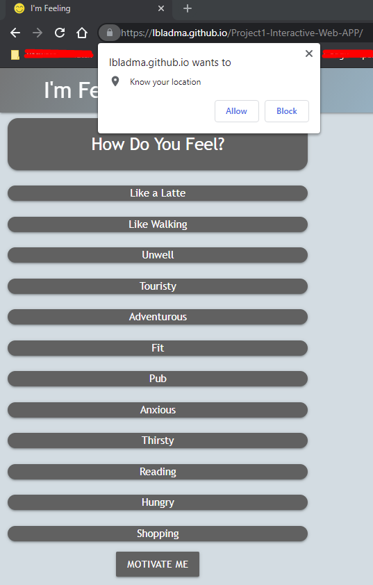
If the User Blocks the location in the browser: 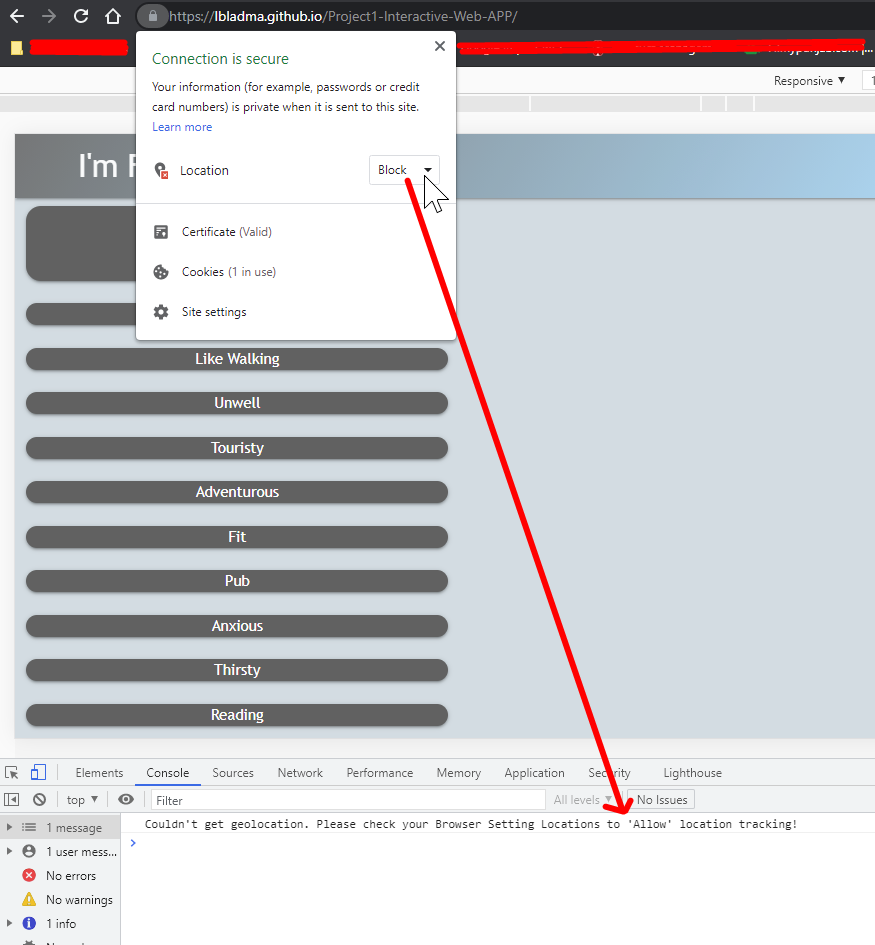
When location of browser is allowed: 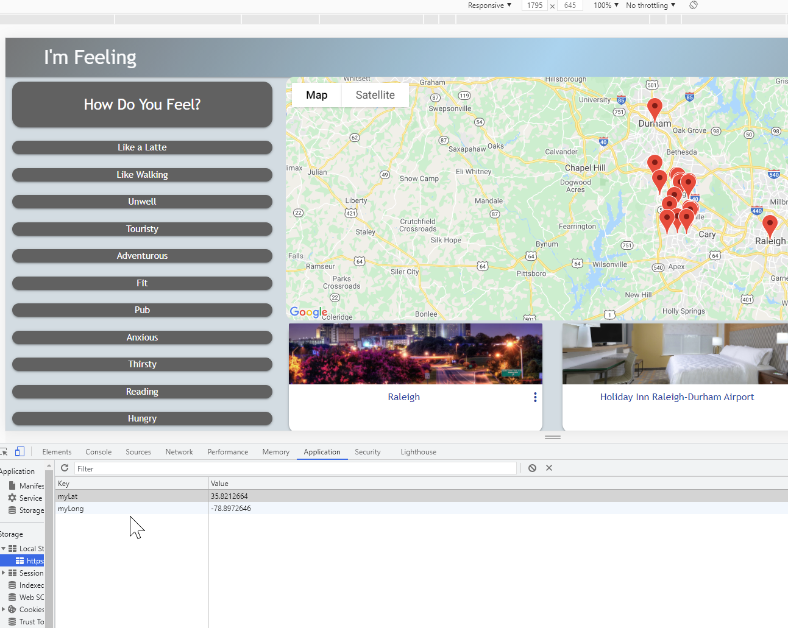
Local Browser stores the Browser Location fetched: 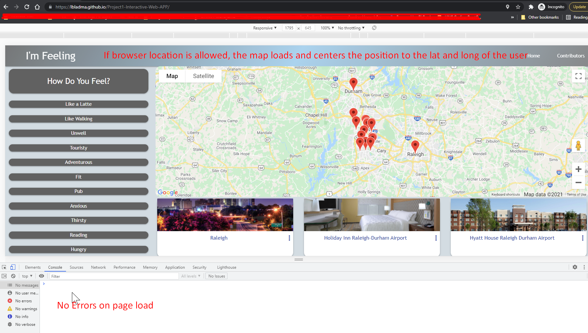
Clicking on a Feeling renders nearby Places in card form: 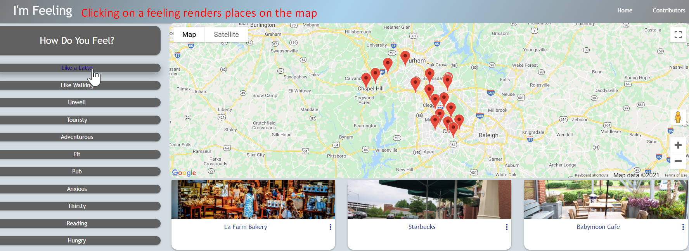
Hovering over the card zooms in on the card,clicking a place unveils the rating & address of the place: 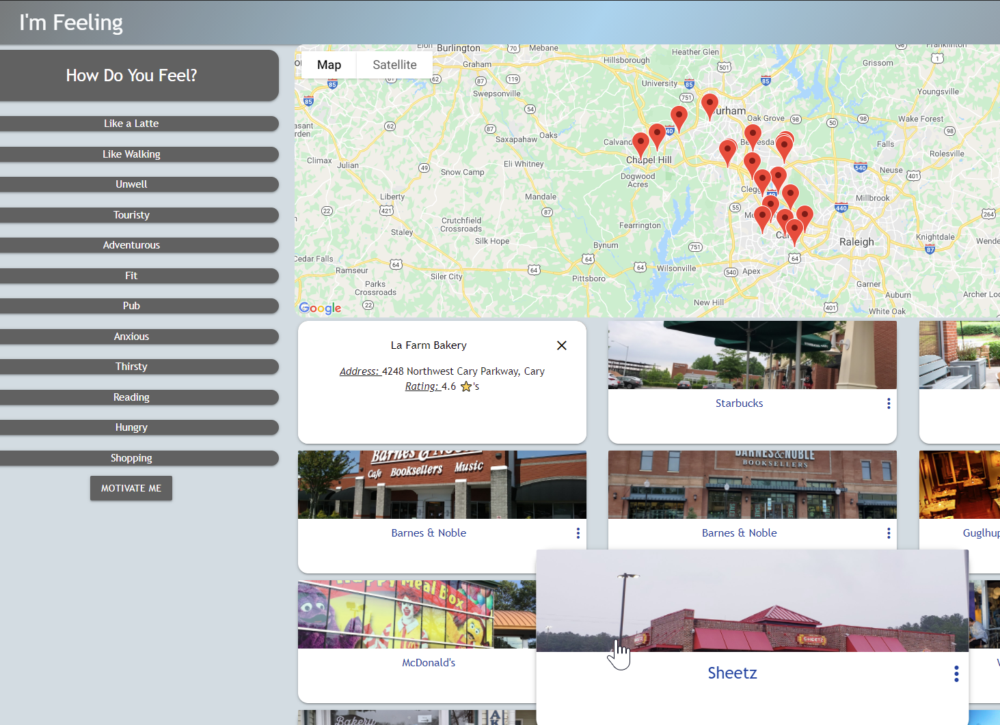
All hoverable clickable elements turn blue (as opposed to white-text):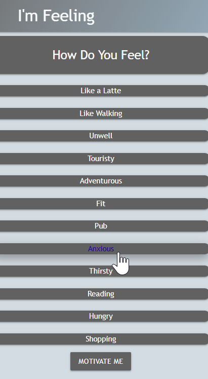
Motivate Me renders a modal with a quote by an author and the last day the quote was modified (notice the blurred out background): 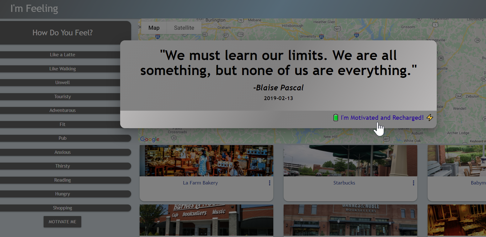
Mobile/Tablet View changes the number of card columns: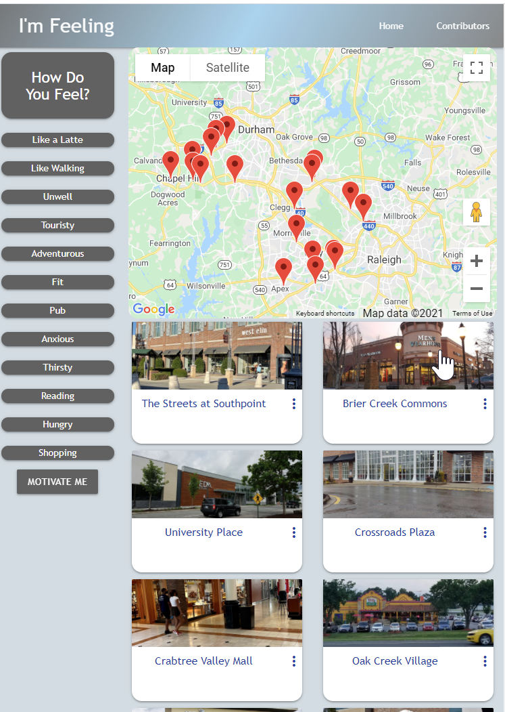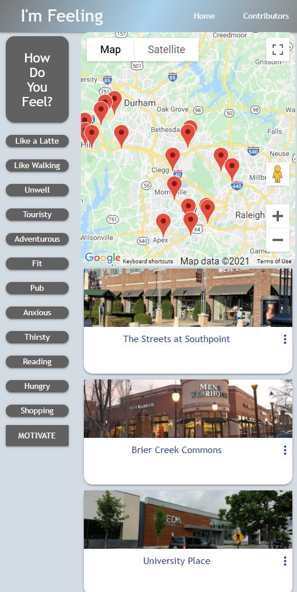
Footer gradient with marquee: 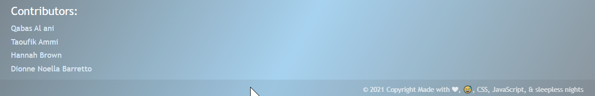
Contributors Page: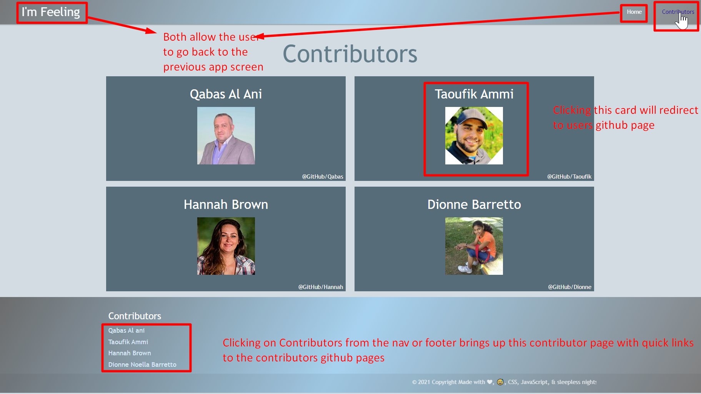 

## Project Requirements

As a group we were required to use everything we’ve learnt over the past six units to create a real-world front-end application that we’ll be able to showcase to potential employers. The project must fulfil the following requirements:
```
✔️ Use a CSS framework other than Bootstrap. 👉 Materialize + CSS
✔️ Be deployed to GitHub Pages. 👉See Project Resources section up top
✔️ Be interactive (i.e., accept and respond to user input). 👉User can click feeling buttons
✔️ Use at least two [server-side APIs](https://coding-boot-camp.github.io/full-stack/apis/api-resources). 👉We've used Maps - Places + GeoLocation and Motivation API's
✔️ Does not use alerts, confirms, or prompts (use modals). 👉Used Modals
✔️ Use client-side storage to store persistent data. 👉Used to store browser lat and long
✔️ Be responsive. 👉Used Materialize for responsiveness on small, medium, large screens
✔️ Have a polished UI. 👉Done
✔️ Have a clean repository that meets quality coding standards (file structure, naming conventions, follows best practices for class/id naming conventions, indentation, quality comments, etc.). 👉 Done
✔️ Have a quality README (with unique name, description, technologies used, screenshot, and link to deployed application). 👉Done
```

## Presentation Requirements
```
Elevator pitch 🎤: a one minute description of your application
Concept 📖: What is your user story? What was your motivation for development?
Process ♻️: What were the technologies used? How were tasks and roles broken down and assigned? What challenges did you encounter? What were your successes?
Demo 💻: Show your stuff!
Directions for Future ⏭️ Development
Links 🔗: to the deployed application and the GitHub repository
```
## Grading Requirements

This project is graded based on the following criteria:

### Technical Acceptance Criteria: 25%

🏁 Satisfies the following code requirements:
```
✔️ Application uses at least two [server-side APIs](https://coding-boot-camp.github.io/full-stack/apis/api-resources)
  👉We've used Maps - Places + GeoLocation and Motivation API's
✔️ Application uses client-side storage to store persistent data. 
  👉Used to store browser lat and long and access it subsequently in the code
✔️ Application doesn't use JS alerts, prompts, or confirms (uses modals instead) 
  👉Used Modals
✔️ Application uses a CSS framework other than Bootstrap 👉Used Materialize
✔️ Application is interactive (accepts and responds to user input) 
  👉User can click feeling buttons
```
### Concept 10%
```
✔️ Application should be a unique and novel idea 
  👉Inspiration from "I'm Feeling" button on Google Search Engine
✔️ Group should clearly and concisely articulate your project idea 
  👉Check
```
### Deployment: 20%
```
✔️ Application deployed at live URL and loads with no errors
  👉Check
✔️ Application GitHub URL submitted 
  👉Check
```
### Repository Quality: 10%
```
✔️ Repository has a unique name 
  👉Done
✔️ Repository follows best practices for file structure and naming conventions 
  👉Done
✔️ Repository follows best practices for class/id naming conventions, indentation, quality comments, etc 
  👉Done
✔️ Repository contains multiple descriptive commit messages
  👉Done
✔️ Repository contains a quality README file with description, screenshot, and link to deployed application 
  👉Done
```
### Application Quality: 15%
```
✔️ Application user experience is intuitive and easy to navigate
  👉Check
✔️ Application user interface style is clean and polished 
  👉Check
✔️ Application is responsive 
  👉Check
```
### Presentation 10%
```
✔️ Your group should present using Powerpoint or a similar presentation software 
  👉Check
✔️ Every group member should speak during the presentation
  👉Check
✔️ Your presentation should follow the [Project Presentation Template](https://docs.google.com/presentation/d/10QaO9KH8HtUXj__81ve0SZcpO5DbMbqqQr4iPpbwKks/edit?usp=sharing)
  👉Check
```
### Collaboration 10%
```
✔️ There are no major disparities in the number of GitHub contributions between group members
  👉Check
```